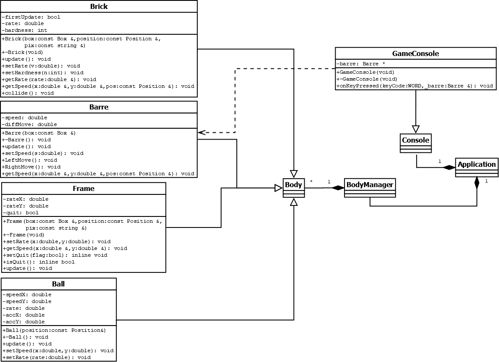

# 
Projet de Programmation C++ :

## 
Casse Briques

## 
RAPPORT 

Du TianRen 15124842 (Cap) 

Cheng RenDe 15124933 

Wang Chenlin 15124855 
 
       

UTSEUS
 

 31 OCT 2018
  
 
 
 
 
 
 
 
 

## 
Sommaire

1.  **Introduction**

> 1.1 Plan du projet
>
> 1.2 Pincipe du projet

2.  **Description**

> 2.1  Principe de fonctionnement
>
> 2.2  UML

3.  **Le codage**

> 3.1  UI & Instructions

<!-- -->
 
 

### 
1. **Introduction** 

Notre groupe a fait un jeu de flipper. C’est un jeu très intéressant.

#### 1.1 **Plan du projet**

>Nous sommes camarades de classe dans la même classe et nous formons une
équipe comme nous connaissons le projet.

>1. nous lisons l'introduction du projet et soulignons quelques points
importants.

>2. nous séparons le projet en plusieurs parties. Simplement selon les
besoins: balle, barre, briques et Frame.

>3.  Du TianRen : Brique & Frame & Game.cpp(main)
>
>    Cheng RenDe : Balle & Barre & Game\_console
>
>    Wang ChenLin : Introduction\_fin & Testing bugs

>4. Debug. Ajouter des fonctionnalités. (Score in BodyManager.h)

>5. Nous dessinons le diagramme uml de nos propres codes.

>6. Nous écrivons les introductions de nos propres codes

>7. Du TianRen résumer le rapport et conclure les autres.
 

####  1.2 **Principe du projet**

>Commençons on par une brève introduction au jeu. Dans ce jeu une balle
rebondit sur les bords haut, gauche et droit de l’écran.  
En bas de l’écran se trouve une barre que le joueur déplace vers la droite ou vers
la gauche avec les touches correspondantes du clavier. La balle rebondit
sur la barre quand elle « tombe » dessus. Par contre, si la balle
atteint le bas de l’écran le jeu est perdu. Apres on vas parler brièvement de notre projet.

### 
2.  **Description**

#### 2.1  **Principe de fonctionnement**

##### **2.1.1 BRIQUE :**

> Le **‘Brick.h’ et le ‘Brick.cpp’** sont pour les brick.
>
> Dans le ‘Brick.h’ nous definions la classe ‘Brick’ qui hérite de la
> classe ‘Body’ donc il peut utiliser touts les fonctions dans ‘Body.h’.
> Dans le ‘Brick.cpp’ nous fait les implémentations des fonctions.
>
> Dans la class ‘Brick’, nous avons le **constructeur et destructeur**.
>
> Le paramètre du constructeur est une référence de struct ‘position’
> (son definition est dans le ‘BodyManager.h’) et une paramètre de la
> classe ‘Body’. Nous faisions la liste de paramètres pour
> ‘Body’(constructeur) qui compris le nom de cet ‘Body’,la référence de
> struct ‘Box’(definir la taille defaut du brique affiché à l'écran ) ,
> struct ‘position’ (décrire le position de la brique pour preposition
> et position), string pix(décrire la forme de brique si plus grand que
> le size de brique (byte) (définié dans le struct Box), il va ‘throw’
> ‘exceptions’) . Plus dans le constructeur, on initialise les deux
> variables member rate(la vitesse de brick), hardness(le fois que le
> ‘ball’ doit choquer la brique avant elle se casse)
>
> Ensuite la fonction **&lt;&lt;void update()&gt;&gt;** est pour
> déterminer la situation de brique qu’il y a combien de fois de
> collision qu’il peut endurer, si son nombre de fois est inférieur ou
> égal à 0, on doit informer le ordinateur de ne plus afficher la
> brique.
>
> Ensuite la fonction **&lt;&lt;void setRate(double v)&gt;&gt;** est
> pour définir une valeur de ‘rate’(l’attribut de brique). Parceque la
> vitesse de ‘Ball’ est égal à le produit de speed (avec derection) et
> de rate, on réalise des effets différents (accélération et
> décélération) des différentes briques sur la balle.
>
> La fonction **&lt;&lt;void setHardness(int n)&gt;&gt;** détermine le
> nombre de fois de durabilité, il y a certaines briques qui ont besoin
> de plus de hits par la balle.
>
> Alors, quand il y a une collision entre la balle et la brique, le
> ‘hardness’(le nombre de fois de durabilité) va diminuer un à la fois.
> C’est la fonction **&lt;&lt;collide()&gt;&gt;.**
>
> Pour donner la valeur de ‘rate’, on utilise la fonction
> **&lt;&lt;getRate&gt;&gt;** avec la référence de ‘rate’.
>
> Dans le même but de obtenir le direction après la collision, on fait
> la fonction **&lt;&lt;getSpeed(double &x, double &y, const Position
> &pos)&gt;&gt;** . Tout d'abord on livre les paramètres vitesse x,y de
> la balle et position. Ensuite on calculer (disX et disY) la différence
> entre la position précédente et la position suivante dans la direction
> x et la direction y. Si la différence cumulative est égal le ‘size’ de
> la ball, ça veut dire qu’il y a une collision entre la brique et la
> balle donc la balle doit changer direction en changeant la vitesse
> avec le direction négative ou 45°

#### 2.1.2  **FRAME :**

> Le ‘Frame.h’ et le ‘Frame.cpp’ sont pour les brick.
>
> Dans le ‘Frame.h’ on definie la classe ‘Frame’ qui hérite de la classe
> ‘Body’ donc il peut utiliser touts les fonctions dans ‘Body.h’. Dans
> le ‘Frame.cpp’ on fait les implémentations des fonctions.
>
> Dans la classe ‘Frame’ on a le constructeur et le destructeur.
>
> Le constructeur(**&lt;&lt;Frame(const Box &box, const Position
> &position, const string &pix)&gt;&gt;**) a le même method de
> constructeur de brique. On utilise les paramètres pour initialiser le
> constructeur de la classe ‘Body’.
>
> Ensuite &lt;**&lt;setRate(double x, double y)&gt;**&gt;, c’est pour
> stocker la valeur de vitesse de la balle avant la collision.
>
> La fonction&lt;**&lt;getSpeed&gt;**&gt; est pour obtenir le vitesse de
> la balle et calculer avec ‘rate’, qui sont la valeur de vitesse après
> la collision.
>
> La fonction **&lt;&lt;setQuit&gt;&gt;** est responsable de déterminer
> si le jeu a échoué. Si la balle est en dehors de la frame. Dans la
> ‘main.cpp’ on détermine ‘true’ pour frameBottom\[i\], ça veut dire que
> si la balle se déplace sous le frameBottom, le jeu va quitter
> (GameOver!). Même method pour **&lt;&lt;isQuit()&gt;&gt;**.

#### 2.1.3 **BARRE :**

> Dans le **&lt;&lt;Barre.h&gt;&gt;** et **&lt;&lt;Barre.cpp&gt;&gt;,**
> on défini la class Barre qui hérite de la classe Body. La class Barre
> comport 2 attributs de double désignant respectivement le speed et le
> diffMove. Le speed décrit la vitesse de la balle. Le diffMove décrit
> le distance de barre passée par seconde.
>
> La class Barre comporte une constructeur qui construit le barre et
> initiale la valeur de diffMove. On utilise la fonction
> **&lt;&lt;setSpeed&gt;&gt;** pour initialise le attribut speed. Le
> méthode **&lt;&lt;LeftMove&gt;&gt;** et **&lt;&lt;RightMove&gt;&gt;**
> détermine le mouvement gauche ou droit de la barre. 
>
>On utilise la fonction **&lt;&lt;update&gt;&gt;** pour définir les conditions du  mouvement de la barre. Lorsque vous mouvez la barre par cliquant sur  les flèches, si la distance cumulée déplacée par une seconde(diffMove)
> est supérieure à la vitesse définie, puis il vas mouvoir.
>
> La fonction très importante est **&lt;&lt;getSpeed&gt;&gt;** . 
> On divise le barre
> en cinq zones, donc la balle tombe sur différentes zones du barre et on change le vitesse en les coeffients differentes en conséquence.

#### 2.1.4  **BALLE :**

> Dans le fichier "BALL.H", nous définissons la classe "BALL" et donnons
> quelques définitions sur la balle, telles que la vitesse de la balle (speedX & speedY) et les coordonnées de la balle (accX & accY). Il existe également des fonctions qui utilisent ces fonctions pour mettre à jour la position et la trajectoire de la balle.
>
> Dans le fichier "BALL.CPP", nous avons implémenté les fonctions de
 toutes les fonctions de "BALL.H". Nous allons d’abord construire un
 BALL solide, puis nous utilisons la fonction
 **&lt;&lt;setSpeed&gt;&gt;** pour donner à la balle la vitesse
 initiale. Pendant le mouvement de la balle, nous ferons un jugement
 lorsque la balle entrera en contact avec d'autres entités. 

>Si la balle  frappe le cadre, la balle va rebondir, à moins que le bas ne soit touché, la partie se termine. Si la balle frappe une brique et une barre, la balle rebondira en conséquence.

#### 2.1.5  **START&FIN :**

> Dans le fichier ‘Introduction\_fin.h’ on fait le introduction de GAME
> et le MERCI à la fin.

#### 2.1.6  **Game\_Console :**

> Dans le ‘GameConsole.h’ et ‘GameConsole.cpp’, on défini la classe GameConsole qui hérite de la classe Console. La class Barre comport un attribut barre de type Barre\* qui pointe sur l’objet Barre. Le rôle de la console est de laisser le joueur contrôler le barre par le
 bouton.
>
> GameConsole comport quart méthode, un constructeur et un destructeur
> pour initialer et détruire le pointeur. 
>
>Le méthode
 **&lt;&lt;setBarre&gt;&gt;** prenant un argument de type Barre& pour
> attribuer le pointeur.
>
>Et la méthode **&lt;&lt;onKeyPressed&gt;&gt;**
 prenant un argument de type WORD permets de contrôler les mouvements
 gauche et droit via la touche A et D. Le bouton A pour déplacer a
 gauche, D pour déplacer a droit.

#### 2.1.7 **GAME :**

> Dans le fichier "Game.CPP"(main()), nous avons déterminé certaines des
> actions au début du jeu. Nous allons d’abord appeler "BodyManager"
 pour définir la barre et la balle dans le jeu et lui donner une
 vitesse initiale.
>
> Ensuite, nous définirons la taille de l’interface
 (Frame) du jeu et les conditions à la fin du jeu (lorsque la balle
 touche le bas). Nous définirons ensuite dix briques et définirons le
 "taux" et la "dureté" de chaque brique. Une fois ces opérations
 terminées, le jeu commence et se termine officiellement. 
>
> Une fois le  jeu terminé, la fonction sera appelée pour libérer la mémoire occupée  par l'entité.
 
 

#### 2.2 **UML**

**(Nous seulement dessinons les parties que nous écrivons )**

 {:width="330" height="495"}

### 
3. **Le codage**

Dans cette partie nous allons vous montrer l'interface utilisateur et
des instructions.

**3.1 Game :**

**3.1.1 Game\_start:**

**3.1.2 Brique et Score:**

1.  Une seule collision de brique = 100 point.

2.  Les briques bleues sont 200 point. Ils peuvent supporter deux
    collision. Après une collision, les briques bleues deviennent rouge.

3.  Les briques rouge sont 100 point. Ils peuvent supporter une
    collision.

4.  Quelque briques ont rates, vous peuvez trouver que la vitesse est
    plus vite ou lent.

**3.1.3 Réfraction, Barre et Frame :**

Nous montrons le reflet de la balle quand elle frappe la barre ou le
cadre avec un angle différent.

La barre a 3 réactions différentes ‘45°,90°,135°’.

La frame aussi mais seulment 135°.

**3.1.4 FIN：**

Lorsque toutes les briques sont cassées ou que la balle tombe, le jeu se
termine automatiquement et le score est calculé.

